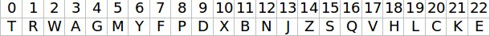

# DNI

This kata is related to the one my teacher did for class: [dfleta-dni](https://github.com/dfleta/Python_ejercicios/tree/master/Poo/DNI)

This is a kata in which i had a first look at the object-oriented programming (POO) and non-static classes, in which a constructor allow us to create objects.

It consist in creating a program in which we give a number of 8 digits and the program returns their letter to get an identifier of Spain called "DNI" (national document identifier).

The "DNI" has 2 parts: a 8 number digit and a letter that is related to the rest of the divison of that number to 23. So we can get the letter in a assignment table.

The program consist in 2 classes that interact between them to get this identifier.

The first one, AssignmentTable, has the relation between the number and the letter given and all the methods that allows us to check if the letter is the correct one and how can we get the correct one.

The class DNI is the one that create the DNI and check if it is correct, in case it is not, we can change the information till it is correct.
