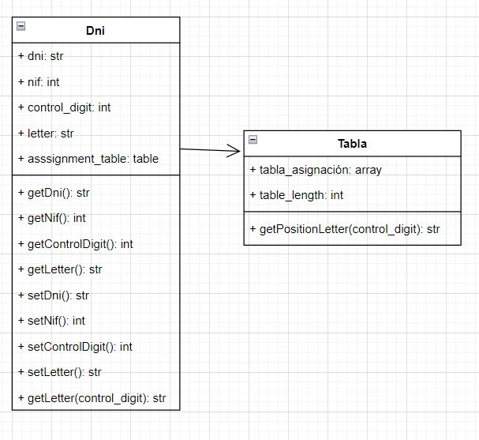

# DNI

This kata is related to the one my teacher did for class: [dfleta-dni](https://github.com/dfleta/Python_ejercicios/tree/master/Poo/DNI). It will consist in two parts of the same kata:

* SRP/OCP: one aproximation to POO using both principles SOLID. ([SRP_branch](https://github.com/ClearCB/DNIKata/tree/KATA_SRP_OCP))
* DDD: trying to solve the same problem, but starting each design driven by the domain about the topic. ([DDD_branch](https://github.com/ClearCB/DNIKata/tree/KATA_DDD))

This is a kata in which i had a first look at the object-oriented programming (POO) and non-static classes, in which we will try to get the letter corresponding to each number using the NIF (fiscal identifier number) .

It consist in creating a program in which we give a number of 8 digits and the program returns their letter to get an identifier of Spain called "DNI".

Using a control digit that consist on dividing the NIF to 23, so the rest will be located in a assignment table which will return the letter corresponding to this control_digit(national document identifier).

SRP / OCP

Using both principles to maintain a clean code, without using vocabulary domain specific.

DDD

Trying to complete the kata using a model, which solves the problem in a simple way but using more specific language focused on the domain of the topic.

To this model, I made an UML classes diagram to complete it.

Visit the spanish goverment documentation to know more about this: [ministerio del interior español](https://www.interior.gob.es/opencms/ca/servicios-al-ciudadano/tramites-y-gestiones/dni/calculo-del-digito-de-control-del-nif-nie/)
